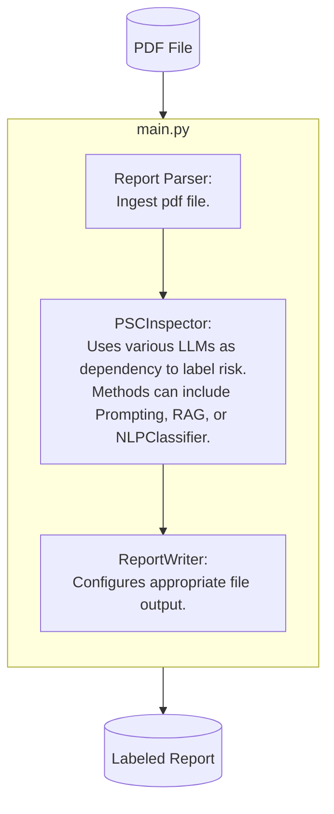

# deficiency-labeler
Label PSC Deficiency with a Risk Label (High, Medium, Low)


## Environment Setup And Usage

This repo uses Conda to manage python version and virtual environment.
```bash
$ conda --version
conda 23.11.0
$ python --version
Python 3.11.9
```

To set up the repo and environment for label. Please follow the following.

```bash
$ cd folder/to/clone/into
$ git clone deficiency-labeler-repo
$ cd deficiency-labeler
$ conda env create --file=requirements.yml
```

### To run the module.
1. Ensure relavant AZURE_OPEN_API variables is in a `.env` file inside `deficiency-labeler` folder. Refer to the link for more [details.](https://python.langchain.com/v0.2/docs/integrations/chat/azure_chat_openai/)
```python
# required environment variable in .env file
AZURE_OPENAI_API_KEY
AZURE_OPENAI_ENDPOINT
AZURE_MODEL
AZURE_API_VERSION
```
2. Run the following command

```bash
$ python src/main.py path/to/sample_inspection_report.pdf
```

## Main Modules of Pipeline

## Folder Structure

```
├───conf                 <- config files.
│   └───base
├───notebooks            <- notebook for exploration.
├───src
│   ├───psclabeler       <- main entrypoint for all modules.
│   │   ├───data_query
│   │   ├───model
│   │   ├───report
│   ├───tests
│   └───main.py          <- main.py for labeling reports.
└───requirements.txt     <- `conda` environment file for reproducing the project.
```

## How to adjust the config
