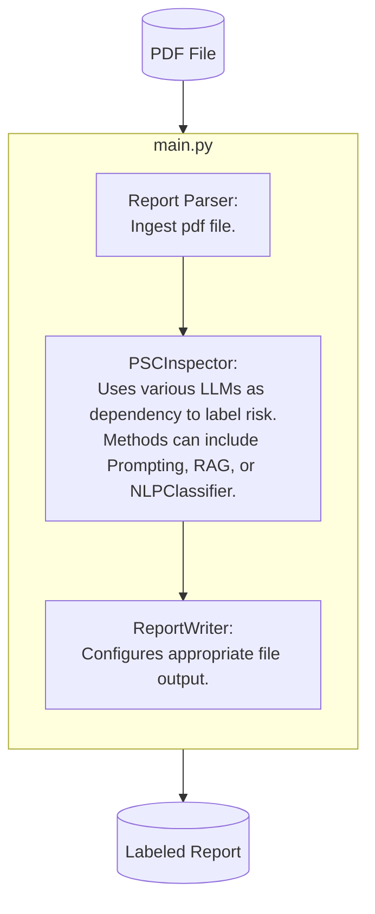

# deficiency-labeler
This repository aims to label any PSC Deficiency Report(pdf) with a Risk Label (High, Medium, Low). 

It ingest the pdf_report, parse individual deficiencies into string format. 

Then a Large Language Model rates the risk through selected method. Current selected method is Fewshot Prompting with Chain-Of-Thoughts Prompting.

Finally, the output is being saved by in required file format. Current defaults to Excel.


## 1. Environment Setup And Usage

This repo uses Conda to manage python version and virtual environment.
```bash
$ conda --version
conda 23.11.0
$ python --version
Python 3.11.9
```

To set up the repo and environment for label. Please follow the following.

```bash
$ cd folder/to/clone/into
$ git clone deficiency-labeler-repo
$ cd deficiency-labeler
$ conda env create --file=requirements.yml
```

### 1.1 - To run the module.
1. Ensure relavant AZURE_OPEN_API variables is in a `.env` file inside `deficiency-labeler` folder. Refer to the link for more [details.](https://python.langchain.com/v0.2/docs/integrations/chat/azure_chat_openai/)
```python
# required environment variable in .env file
AZURE_OPENAI_API_KEY
AZURE_OPENAI_ENDPOINT
AZURE_MODEL
AZURE_API_VERSION
```
2. Run the following command

```bash
$ conda activate psc-label
$ python src/main.py path/to/sample_inspection_report.pdf
```

## 2. Main Modules of Pipeline

Below shows the flow of the pipeline with the following BaseClass.

- **ReportParser**: reads in a `pdf_file_path` and outputs `dict[int,str]` for model input. Defaults to `SampleReportParser`.
- **PSCInspector**: takes in output from ReportParser and iterates `rate_risk` through each deficiency. Defaults to `FewShotLLMPSCInspector`.
  - To use `ZeroShotLLMPSCInspector`, please configure the `yml` config with instruction from 2.1
  - To use other prompting/ rag or classification method, please create a custom `PSCInspector` that requires to inherit required abstractmethod.
    - Example, to implement RAG LLM, LLM should read from a vector_store or process vector_embedding in this class before constructing a prompt for rate_risk.
  - Currently `rate_risk` is aim to rate 1 deficiency.
- **ReportWriter**: takes the output from PSCInspector and writes out the classification and details for each deficiency. Defaults to `ExcelReportWriter`.
  - To write to another report type, please create custom `ReportWriter` and let `save_report()` method.
  - Output folder of the report is defined in pipeline.yml.
  - the sample report output is `.\data\labeled_report-1724075886.xlsx`



### 2.1 - How to adjust the pipeline via config file

Most of the modules in the pipeline are adjustable via yaml config in `conf/base/pipeline.yml` via the `*_dotpath` suffix. 

The `_dotpath` as a string is being instantiated as an object of that class. Notice the `()` at the end of each example for instantiation of the object.

```python
# for example
"psclabeler.model.labeler.FewShotLLMPSCInspector"

# after passing into utils.load_class_object
model = utils.load_class_object("psclabeler.model.labeler.FewShotLLMPSCInspector")(params)
# is equvialent to 
from psclabeler.model.labeler import FewShotLLMPSCInspector

model = FewShotLLMPSCInspector(params)

```

## 3. Folder Structure

```
├───conf                 <- config files.
│   └───base
├───notebooks            <- notebook for exploration.
├───src
│   ├───psclabeler       <- main entrypoint for all modules.
│   │   ├───data_query
│   │   ├───model
│   │   ├───report
│   ├───tests
│   └───main.py          <- main.py for labeling reports.
└───requirements.txt     <- `conda` environment file for reproducing the project.
```


